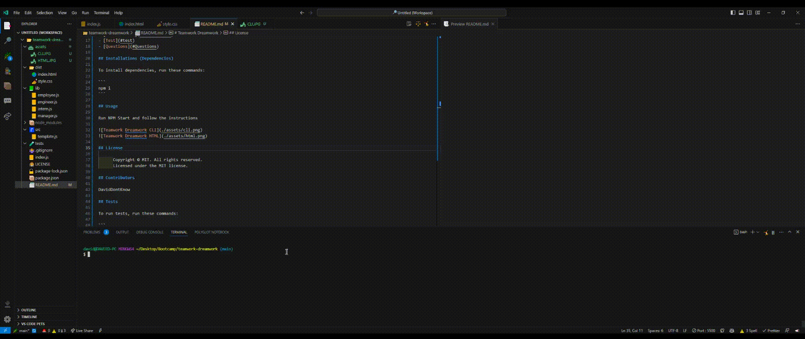

# Teamwork Dreamwork


## Description

A team tracker

## Table of Contents

- [Installations](#dependencies)
- [Usage](#usage)

- [License](#license)

- [Contributors](#contributors)
- [Test](#test)
- [Questions](#Questions)

## Installations (Dependencies)

To install dependencies, run these commands:

```
npm i
```

## Usage

Run NPM Start and follow the instructions



## License

      Copyright © MIT. All rights reserved.
      Licensed under the MIT license.

## Contributors

DavidDontKnow

## Tests

To run tests, run these commands:

```
npm test
```

## Questions

### For questions please contact:

DavidDontKnow
Github URL: [DavidDontKnow](https://github.com/DavidDontKnow/)
Contact Email: DavidDontKnow02@gmail.com
